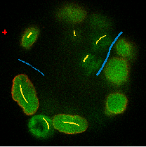
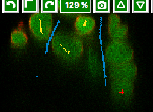
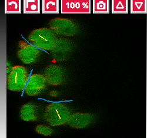
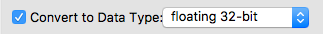
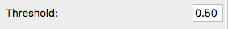
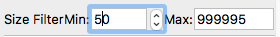
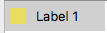
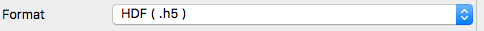

**Ilastik**
===========

Description:
------------

Ilastik is an interactive learning and segmentation toolkit, with which
you can use to leverage machine learning algorithms to easily segment,
classify, track and count your cells or other experimental data,
see \ https://www.ilastik.org/\ .

In the first part, we will show how to use Ilastik user interface to
perform segmentations on multi-z images stored in OMERO. The connection
between OMERO and Ilastik is facilitated via Fiji, for which both OMERO
and Ilastik have plugins. The segmentation steps in this part are
recorded and saved in the form of an ilp file in Ilastik (and Ilastik
project). The ilp file is used later for the scripting workflow.

In the second part, the segmentation (using Pixel classification routine
of Ilastik) of the multi-z images is run in a batch mode. For this, ilp
is used in a script, which runs Ilastik in a headless mode, consuming
batch of images (coming from an OMERO Dataset) and segmenting these
images according to the parameters configured and saved in the ilp in
the manual step above. We offer two scripts covering this workflow one
running in Fiji, and the other using the python frames to export images
directly from OMERO to the Ilastik running headlessly. Also, we describe
in this part how to use Ilastik routine Object classification to
classify objects on images from OMERO manually.

In the third part, a manual tracking workflow is shown on images of
cells undergoing mitosis. The lineage of the cells is being followed.
The images are timelapses from the Image Data Resource, the “mitocheck”
set. As a result of this step, again, an ilp file is produced and saved
for further use by the follow-up scripting workflow, similarly to the
steps one and two described for the multi-z images above.

We will show:

-  How to manually open images from OMERO in Ilastik using the Fiji
      plugin for OMERO and Fiji plugin for Ilastik

-  How to segment the multi-z images in Ilastik and produce an Ilastik
      Project (ilp file) recording the steps

-  How to save the results of the segmentation (ROIs and Probability
      maps) in OMERO, using the manual workflow and Fiji

-  How to run a script in Fiji, consuming the ilp file and running the
      segmentation of the images coming from an OMERO Dataset, saving
      the ROIs on the original images in OMERO

-  How to run a python script, not using Fiji, but directly connecting
      OMERO and Ilastik consuming the ilp file and running the
      segmentation of the images coming from an OMERO Dataset, saving
      the ROIs on the original images in OMERO

-  How to perform tracking on timelapse images of mitotic cells open
      from OMERO via Fiji into the Ilastik user interface and producing
      timelapses showing lineage of the cells

-  How to use the ilp file containing the tracking parameters in a
      script producing a lineage timelapses of the cells for a whole
      Plate of timelapses stored in OMERO

Setup:
------

**Ilastik installation**

Ilastik has been installed on the local machine. See \ https://www.ilastik.org/\  for details.

**Ilastik plugin for Fiji installation instructions**

Start Fiji. Update it (Help > Update ImageJ) and in the Manage Update
Sites check the checkbox next to the “Ilastik” site.
After the update was successful, restart your Fiji. The new Ilastik menu
item should be under Plugins menu.
Note: The Ilastik menu item might be the last in the Plugins dropdown,
not necessarily alphabetically ordered.

**OMERO plugin for Fiji installation instructions**

See [LINK TO FIJI INSTALL in a sister doc]

**Resources:**
--------------

-  IDR data (idr0062) \ https://idr.openmicroscopy.org/webclient/?show=project-801

-  IDR data \ https://idr.openmicroscopy.org/webclient/?show=screen-102

-  Script used [LINK to SCRIPTs]

**Step-by-step:**
-----------------

Manual training of z-stack segmentation in Ilastik:
---------------------------------------------------

1.  Open Fiji, go to Plugins > OMERO > Connect to OMERO and connect to OMERO.server provided using the credentials provided.

2.  Find the idr0062 Project, the Blastocysts Dataset, open the first image in Fiji.

3.  After image has opened in Fiji, go to Plugins > Ilastik > Export HDF5.

4.  Note: The Ilastik menu item might be the last in the Plugins dropdown, not necessarily alphabetically ordered.

5.  Select a local directory to export to and save the image locally as an ..h5 file.

6.  Repeat this step with several images from the Blastocysts Dataset of idr0062.

7.  Start Ilastik.

8.  Click on Pixel Classification.

9.  Save a new Project in Ilastik.

10. Still in Ilastik, open the image you saved as .h5 in previous steps above (central pane, Add file button)

11. Three views will open, xy, xz and yz. You can explore the orthogonal views by clicking onto the checkbox in bottom right.

12. In Left-hand pane, click Feature Selection. Select all available features.

13. You can explore the features at the bottom left corner, but this takes time…

14. Click on “Training” harmonica in the Left-hand pane

15. The training UI comes in left-hand pane with two labels already pre-defined by default.

    .. image:: images/ilastik1.png

16. Select the first label, and by drawing LINES into the images, select a couple of cells in all three views.

17. i\ |image1a|\ .\ |image2a|\ |image3a|

18. Select the second label, and again drawing lines, select some background (also select the narrow “channels” between two almost adjacent cells as bckgr (draw a line through them).

19. Click on Live Update button - this will take time, as the image has 237 planes.

20. Add new lines on cells which are too dim to be selected.

21. Click on Live Update…repeat

22. Stop Live Update

23. Click on “Suggest Features” button (to the left of “Live Preview" button)

24. New UI window will open.

25. Click on “Run Feature Selection” in the left-hand pane of this new window. This will take time.

26. Click on “Select Feature Set” button in the bottom middle of the window.

27. The “Suggest Features” window will close on this and you are back in the main Ilastik window.

28. Click “Live Update” again.

29. Toggle the images produced visible or not using the “eye” icons and the rendering settings of the particular images in the list in bottom-left corner. Below is an example of viewing the “Segmentation Label 1” and “Segmentation Label 2” layers viewable, the other layers (e.g. “Raw data”) are toggled invisible.

30.     .. image:: images/ilastik5.png

31.     .. image:: images/ilastik6.png

32. 

33. Add new lines if some segmentation still does not look right.

34. Click on the “Prediction Export” harmonica tab. In this tab, we will prepare the parameters of the exported images only, and will do the exporting itself later using the “Batch processing” harmonica.

35. In the “Prediction Export” harmonica, select the features to be exported in the “Source” dropdown menu in the left-hand pane. Export sequentially “Probabilities” and “Simple Segmentation” for all 3 images you opened from OMERO via Fiji, using the “Batch processing” harmonica tab, see below.

36. First, start with selecting “Simple Segmentation” In the “Choose Export Image Settings”, select the “Convert to data Type” parameter to be “floating 32 bit” \ |image6a|\ . The files will be exported into the folder where the original images were, unless you choose otherwise.By default, the export format is HDF5 (file extension .h5).

37. Now, select in the left-hand pane the harmonica “Batch processing”. In the centre top row of the view, click on “Select Raw Data Files…”. Select all the 3 raw .h5 files on your local machine, including the one you have just trained your pixel classification on. (You exported the files from OMERO via Fiji locally, using the script JM has written, see above). Click onto the “Process all data files” button in the left-hand pane.

38. This will create three .h5 files in the folder you have chosen in the “Choose Export Image Settings” window (by default, these files will be placed in the folder where your raw data exports from OMERO are), the files will be named “...Simple Segmentation.h5”

39. 

40. Return to “Prediction Export” harmonica, select the “Probabilities parameter in the “Source” dropdown. Go to the “Batch processing" harmonica and click onto the “Process all data files” button in the left-hand pane. This will create another three .h5 files in the local folder, named “...Probabilities.h5”.

Manual creation of ROIs in Fiji based on segmentations from Ilastik and saving the ROIs to OMERO:
-------------------------------------------------------------------------------------------------

1.  Go to Fiji, Plugins > Ilastik > Import…

2.  Browse to one of the “..._Simple Segmentation.h5” files which was created in ilastik in previous step and set the “Axis Order” to tzyxc (this might be the default for you). Do not check the checkbox “Apply LUT”. Click OK.

3.  The 3D image will open in Fiji. Select Image > Adjust > Brightness and Contrast. Adjust the “max” slider to the left, until you see the image grow grey (it is probably black just after opening).

4.  .. image:: images/ilastik9.png

5.  Note: Because in ilastik, the “Simple Segmentation” images have the values of 2 where there is an object and 1 for Background, we need to invert the image for Object Analysis in Fiji. The object analysis (done by the “Analyze particles” plugin) is done in order to create ROIs which can be saved to OMERO.

6.  Select Image > 8 bit. This will convert the values in the image into either 0 (cells) or 255 (background).

7.  Select Edit > Invert. This is needed for the subsequent “Analyze particles” plugin - white objects on black background.

8.  Select Analysis > Analyze Particles.

9.  Change the “Size(pixel^2)” parameter to “50-infinity”

10. .. image:: images/ilastik10.png

11. Click OK and in the next dialog answer “Yes”

12. Select Plugins > OMERO > Save image(s) to OMERO. In the importer dialog, select the target Project and Dataset in OMERO or choose a new one.

13. This will import the “Simple segmentation” image into OMERO with the ROIs from Fiji on it and the contents of the Results table will be attached to this new image.

14. In order to have the ROIs from Fiji also on the original, raw image in OMERO:

15. Do not close the ROI Manager and the Results table

16. Open the original raw image from OMERO into Fiji

17. Click on the opened image

18. Select Plugins > OMERO > Save ROI(s) to OMERO (alternatively, you can re-run the analysis in Fiji by clicking on “Measure” in the ROI manager of Fiji to produce a new Results table)

19. In the new dialog, select a name for your results table which will be attached now to the original image

20. Clcik OK

21. ROIs and results will be now added to the original, raw image in OMERO

22. .. image:: images/ilastik11.png

23. Repeat this workflow with the “...Probabilities.h5” files. Also, attach the ilastik Project itself to the Dataset containing original data in OMERO.

Scripting workflow on z-stacks using Ilastik headless, Fiji and OMERO
---------------------------------------------------------------------

Groovy Script run in Fiji (done), find the script on [LINK to SCRIPT]:

1. Open images (one by one) from an OMERO Dataset (hardcoded in the script) into Fiji and export them as h5 to a local folder specified interactively by the user during the run of the script. It is assumed that the folder specified by the user contains the ilastik Project prepared beforehand (see next step below). The export is facilitated by the ilastik plugin for Fiji.

2. Start headless ilastik, using the “Pixel classification:” module (done by the script from Fiji, using the ilastik plugin for Fiji). The script feeds into the “Pixel classification” ilastik module an ilastik Project (ilp file created previously manually using the workflow above), and also the raw h5 image which the script just exported to the local machine from Fjii.

3. The headless ilastik “Pixel classification” module produces “Probabilities” map - this map is immediately opened into Fiji (again going via the ilastik plugin for Fiji).

4. In Fiji, the Analyze Particles plugin is run on the “Probabilities" map to produce ROIs. Once the ROIs are produced, they are saved to OMERO onto the original raw image which was opened by the script at step 1.  above.

Scripting workflow on z-stacks using Ilastik headless, python and OMERO
-----------------------------------------------------------------------

Similar script, but not using Fiji, was prepared. The script performs
the same steps as the Fiji script above, but using python arrays. The
advantage of this approach is the ease of use and speed, as one client
side software component (Fiji) is not used. [LINK TO PYTHON SCRIPT on
idr0062 dataset]

Manual workflow of Object classification on z-stacks in Ilastik
---------------------------------------------------------------

1.  Start ilastik, choose the “Object classification with Prediction maps” option and create a new Project and save it.

2.  Select in the “Raw data” tab the raw image stored locally and in the “Prediction maps” tab the prediction map which you saved from the “Pixel classification” module for this image previously.

3.  Click on “Threshold and Size filter” harmonica in the left-hand pane. This step discerns the objects form background by means of thresholding (note that the “Prediction maps” values are between 0 and 1, where 1 is 100% probability that the pixel is a cell, 0 is a 100% probability that the pixel is backgr.) The other parameter to specify the object except threshold in this tab is size of the object.

4.  Threshold is 0.5 (if the probability of a pixel is higher than 0.5, then it is deemed to be a cell). |image10a|

5.  Change Size to minimum 50. |image11a|\ .

6.  Leave the rest of the parameters at default and click Apply

7.  A new image will be added to the stack at bottom left called “Final output”. The objects are displayed on it in color coding. Again, you can toggle the images visible and change intensities in bottom left corner.

8.  Click on “Object Feature Selection” harmonica and click on the button “Select Features”.

9.  In the new window, click on “All excl. Location” button to select almost all features.

10. Click on the “Label classes” harmonica, click on the yellow label (Label 1) |image12a|\ and select all the cells in all 3 orthogonal views images.

11. .. image:: images/ilastik15.png

12. Click on “Object information export” harmonica.

13. Changing the “Source” dropdown menu, export sequentially “Object Predictions” and “Object Probabilities”.

14. Click on “Configure Feature Table Export” button in the left-hand pane and configure the location of the exported Also, changing the export format of the table in the “Format” dropdown menu, export sequentially the table as HDF as well as CSV format.\ |image14a|

15. In the “Features” harmonica, click the “All” button to export all features.

16. Click OK.

17. Back in the main ilastik interface, click “Export All” (repeat as necessary to export all formats of the images and the 2 formats of the export table).

18. Save the Project.

19. Import the CSV to OMERO, as well as the Probabilities.

20. Make an OMERO.table out of the CSV and attach it on the Project in OMERO. This can be done using populate_metadata.py plugin or from scratch using the extended groovy script from Fiji.

21. Show everything in OMERO.parade…

Manual workflow of tracking of mitosis in Ilastik
-------------------------------------------------

1. Use the steps above to do Pixel classification - open Ilastik, create a new Pixel classification project, feeding in the raw data in h5 form. The data come from \ https://www.ilastik.org/download.html\ , more concretely the “Mitocheck 2D+t” download \ http://data.ilastik.org/mitocheck.zip\ . Download, unzip and feed the h5 file which has not the “export” in its name into this step (Pixel classification).

2. Follow the steps of Pixel classification as described above in the idr0062 workflow - you will have to

   a. Adjust the parameters, saving the new project as “mitocheck-pixel-class.ilp”

   b. Export “Probabilities”, which can be exported as “mitocheck_94570_2D+t_01-53_Probabilities.h5”

   c. Close and reopen Ilastik. Open the projec “conservationTracking.ilp” from the folder you downloaded from the Ilastik site. In the “Raw data”, tab of “Input data” make sure the raw data are pointing to where you have your “mitocheck_94570_2D+t_01-53.h5” file locally. Further, in the “Prediction maps” tab of “Input data”, exchange the file there by right-clicking on it and selecting the “Replace with file” and replace this file with the “mitocheck_94570_2D+t_01-53_Probabilities.h5” which you exported from the Pixel classification workflow (see ad b. above)

   d. Run through the tabs in the LHP, making sure that when Thresholding, you swap the blue and yellow objects (my Pixel class. produced a probabilities map which is swapped in the sense objects vs bckgr coloring). Also, you have to manually select the cells which are dividing and not dividing in the corresponding tabs in LHP in quite a few timeframes, see \ https://www.ilastik.org/documentation/tracking/tracking#3-division-and-object-count-classifiers\  for how to do it.

   e. Further, you have to discern false detections, and 1 object and 2 object blobs manually on quite a few frames, the LHP harmonice is called Object Count classification, as described in \ https://www.ilastik.org/documentation/tracking/tracking#3-division-and-object-count-classifiers\ , second part.

   f. Once done, in the Tracking tab in left-hand paneHP, click on “Track !” button, making sure you did not change any params inadvertently. This will take a while.

   g. Select the “Tracking Results Export” tab in LHP and define your export target dir, then export in a row
         1. “mitocheck_94570_2D+t_01-53_Object-Identities.h5”,
         2. “mitocheck_94570_2D+t_01-53_Tracking-Result.h5”,
         3. “mitocheck_94570_2D+t_01-53_Merger-Result.h5” and
         4. “mitocheck_94570_2D+t_01-53_CSV-Table.h5.csv”

      These are 3 timelapses and one CSV with the tracking results.

   h. Save the Project as “mitocheck-tracking-serious.ilp”. This is the main starting point for the automatic pipeline from OMERO. The pipeline is

      i. “mitocheck-pixel-class.ilp” which

         1. consumes the “mitocheck_94570_2D+t_01-53.h5”
         2. produces the “mitocheck_94570_2D+t_01-53_Probabilities.h5”

 
      ii. “Mitocheck-tracking-serious.ilp” which

         1. consumes 
            
            “mitocheck_94570_2D+t_01-53.h5”
            “mitocheck_94570_2D+t_01-53_Probabilities.h5”

         
         2. produces the outputs
            
            “mitocheck_94570_2D+t_01-53_Object-Identities.h5”
            “mitocheck_94570_2D+t_01-53_Tracking-Result.h5”
            “mitocheck_94570_2D+t_01-53_Merger-Result.h5”
            “mitocheck_94570_2D+t_01-53_CSV-Table.h5.csv”

Scripting workflow of tracking of mitosis in Ilastik
----------------------------------------------------

The automated pipeline using a python script was produced for the
tracking workflow, see [LINK to MITOCHECK PYTHON SCRIPT]

.. |image0| image:: media/image5.png
   :width: 1.5in
   :height: 1.34375in

.. |image4| image:: media/image8.png
   :width: 3.32292in
   :height: 1.95833in
.. |image5| image:: media/image12.png
   :width: 5.40104in
   :height: 4.94396in

.. |image7| image:: media/image6.png
   :width: 4.53125in
   :height: 3.51042in
.. |image8| image:: media/image13.png
   :width: 3.29167in
   :height: 3.03125in
.. |image9| image:: media/image15.png
   :width: 4.39063in
   :height: 4.3273in

.. |image13| image:: media/image14.png
   :width: 5.66146in
   :height: 4.01927in

