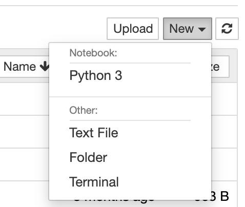

Install ilastik and OMERO Python bindings
==========================================

In this section, we show how to install ilastik in a `Conda <https://conda.io/en/latest/>`_ environment.
We will use the ilastik API to analyze data stored in an OMERO server. We will use OMERO.py to interact with the OMERO server.

Setup
-----

We recommend to install the dependencies using Conda.
Conda manages programming environments in a manner similar to 
`virtualenv <https://virtualenv.pypa.io/en/stable/>`_.
You can install the various dependencies following the steps below (Option 1) or build locally a Docker Image
using ``repo2docker`` (Option 2). When the installation is done, you should be ready to use the ilastik API and OMERO, see :doc:`gettingstarted`.

The installation below is needed to run the scripts and/or notebooks. If you wish to start your own environment without the scripts/notebooks, copy locally into an ``environment.yml`` file the content of 
`binder/environment.yml <https://raw.githubusercontent.com/ome/omero-guide-ilastik/master/binder/environment.yml>`_, remove or add the dependencies you need and run the commands below to create a conda environment.

*Option 1*
~~~~~~~~~~

- Install `Miniconda <https://docs.conda.io/en/latest/miniconda.html>`_ if necessary.

- If you do not have a local copy of the `omero-guide-ilastik repository <https://github.com/ome/omero-guide-ilastik>`_, first clone the repository::

    $ git clone https://github.com/ome/omero-guide-ilastik.git

- Go into the directory::

    $ cd omero-guide-ilastik

- Create a programming environment using Conda::

    $ conda create -n ilastik python=3.7

- Install ilastik, its dependencies and ``omero-py`` in order to connect to an OMERO server using an installation file::

    $ conda env update -n ilastik --file binder/environment.yml 

- Activate the environment::

    $ conda activate ilastik

- Make sure that ``ilastik-meta`` can be executed::
   
    $ chmod -R +x PATH_TO_CONDA/envs/ilastik/ilastik-meta

*Option 2*
~~~~~~~~~~

Alternatively you can create a local Docker Image using ``repo2docker``, see :download:`README.md <https://github.com/ome/omero-guide-ilastik/blob/master/README.md>`::

    $ repo2docker .

When the Image is ready:

- Copy the URL displayed in the terminal in your favorite browser

- Click the ``New`` button on the right-hand side of the window

- Select ``Terminal``

- A Terminal will open in a new Tab

- A Conda environment has already been created when the Docker Image was built

- To list all the Conda environment, run::

    $ conda env list

- The environment with ilastik and the OMERO Python bindings is named ``notebook``, activate it::

    $ conda activate notebook
